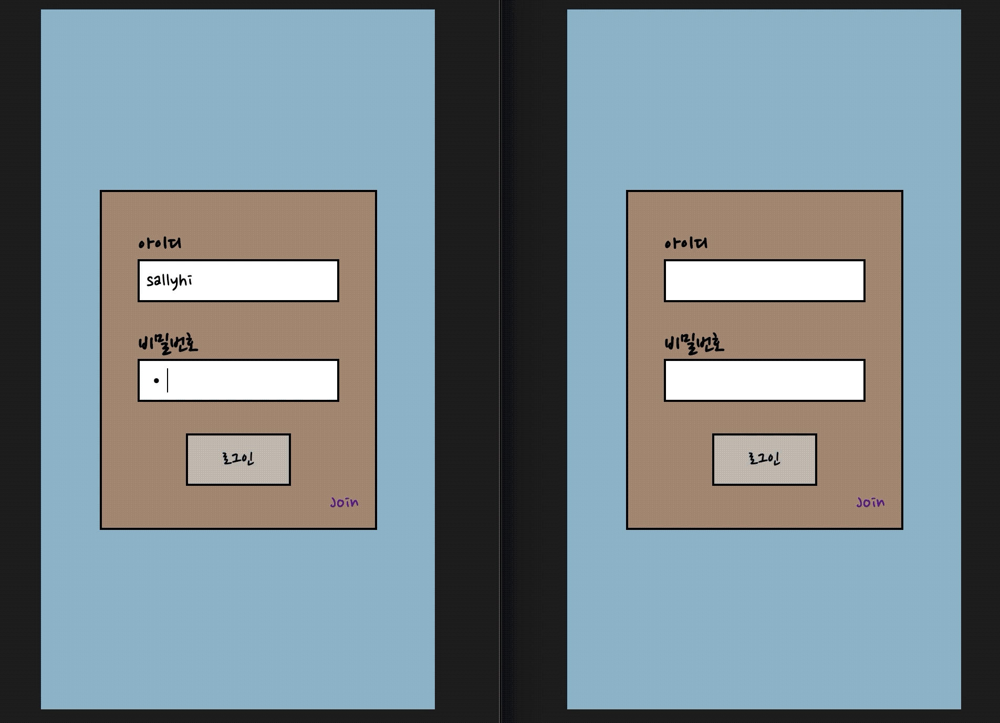
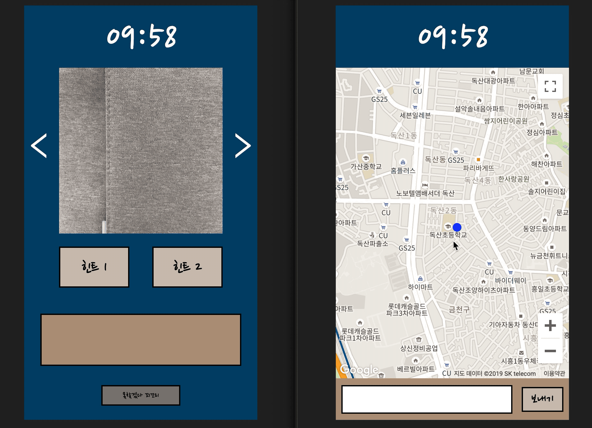
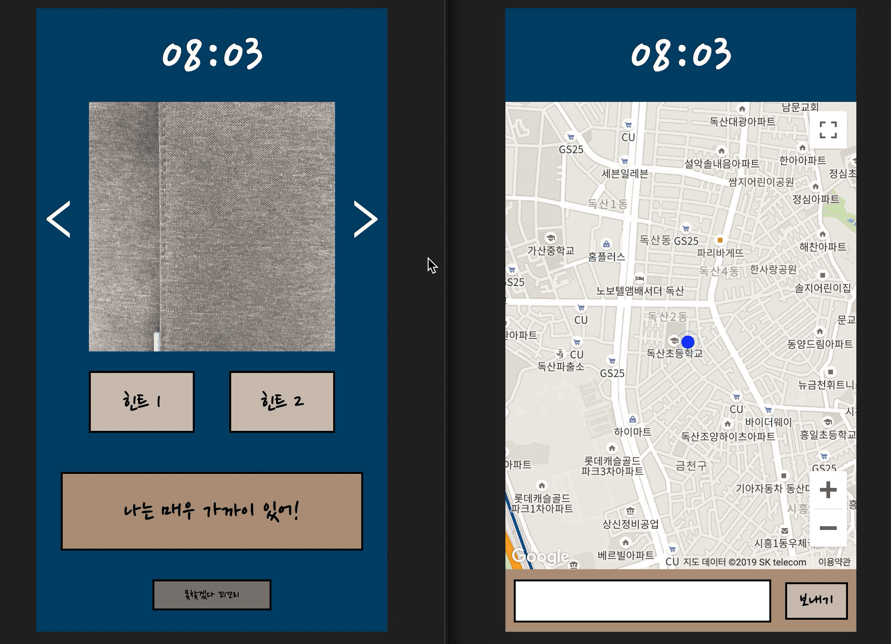
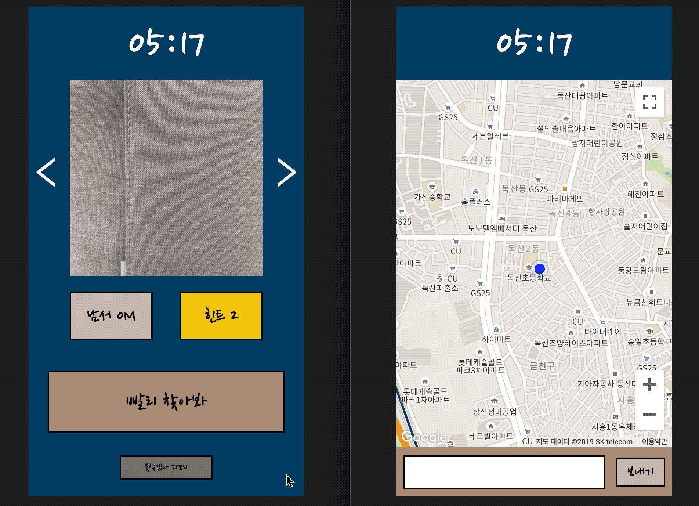

## Introduction

나를 찾아줘(Find Me)는 근거리에 위치한 익명의 사용자들끼리 숨바꼭질하는 모바일용 웹 게임입니다. 


## Preview

- Screen shot

   -회원가입

      

   -로그인

      

   -게임대기/ 상대방 연결/ 숨는 사람 힌트 사진촬영

      

   -술래 사진 힌트 확인/ 숨은 사람이 술래에게 힌트 메세지 보내기

      

   -술래 첫번째 힌트

   

   -술래 두번째 힌트

   

   -술래 게임 포기

   


## Requirements

- 최신 Chrome Mobile Brower 권장

- 카메라 및 위치 접근 권한 필수


## Game Rules

1. 로그인 후 시작하기를 누르면 반경 500m 이내 위치한 게임 상대를 찾습니다.
2. 상대방과 연결되면 술래와 숨을 사람이 정해집니다.
3. 숨을 사람은 15초 내로 주변 힌트 사진을 3장 촬영해야합니다. (15초내 촬영하지 못하면 게임이 종료됩니다.)
4. 사진이 술래에게 전달되면 게임이 시작되고, 술래는 10분내로  상대방을 찾아야합니다.
5. 술래는 8분이 지나면 첫번째 힌트인 상대방과의 거리와 방향을 확인할 수 있습니다.(1회 제한)
6. 술래는 6분이 지나면 상대방과 가장 가까운 편의시설 위치 정보를 확인할 수 있습니다.
7. 숨은 사람은 술래의 실시간 위치를 확인 할 수 있고, 술래에게 힌트 메세지를 보낼 수 있습니다.
8. 10분 이내에 술래와 숨은 사람의 거리가 50m 이내가 되면 성공으로 게임이 종료됩니다.
9. 10분 이내에 술래가 숨은 사람을 못찾거나, 포기버튼(못찾겠다 꾀꼬리)을 누르면 실패로 게임이 종료됩니다.


## Prerequisites

#### Client

- [Google Developers Console](https://console.developers.google.com) 에서 Goolge Maps Javascript Api를 발급 받습니다.

- `.env` 파일을 생성하여 아래 코드를 복사하여 붙여넣은 후 <google-api-key>에 발급받은 Google Api Key 를 입력합니다.

```
REACT_APP_GOOGLE_API_KEY = <google-api-key>
```


#### Server

- [KakaoDevelopers](https://developers.kakao.com/apps) 에서 '내 애플리케이션'을 생성하여 REST API 관련 Kakao Api Key를 발급받습니다.

- `.env` 파일을 생성하여 아래 코드를 복사하여 붙여넣은 후 MongoDB Connection String, Jwt Secret Key 그리고 발급받은 Kakao Api Key를 입력합니다.

```
DATABASE_URL=<mongoDB-connection-string>
SECRETKEY=<jwt-secret-key>
KAKAO_API_KEY=<kakao-api-key>
```


## Installation

#### Client

```
git clone https://github.com/kangsally/find-me-client
# .env파일 root directory에 추가
npm install
npm start
```


#### Server

```
git clone https://github.com/kangsally/find-me-server
# .env파일 root directory에 추가
npm install
npm run dev
```


## Skills

#### Client

- ES2015+

- React

- Redux

- React Router

- Web Socket(Socket.io-client)

- Web RTC

- Geolocation API

- Scss


#### Server

- ES2015+

- Node.js

- Express

- JSON Web Token Authentication

- MongoDB, Atlas

- Mongoose

- Web Socket(Socket.io)


## Test

#### Client

- Jest for Redux and Util function test

- End To End(E2E) Test with Cypress.io


#### Server

- Chai, Sinon for Socket test


## Other tools

- Git을 이용한 project 관리

- Trello를 이용한 task 세분화 및 스케줄 관리

- Balsamiq Mockups 3를 이용한 Mockup design


## Deployment

#### Client

- Netlify

- Custom Domain


#### Server

- Amazon Web Services(AWS) Elastic Beanstalk

- Circle CI를 이용한 빌드 자동화

- Custom Domain


## Challenges

- React Hook으로 컴포넌트를 만들었는데, 처음에는 낯설다는 느낌을 많이 받았지만 사용할수록 simple하다는 장점을 느낄 수 있었습니다.

- HTML5에서 제공하는 Web RTC와 Geolocation API로 카메라와 위치접근 기능을 사용하면서, 브라우저별 제공 여부 등 고려해야할 사항들이 많다는 것을 알게 되었습니다.

- Socket으로 실시간 게임이 진행이 되다보니 socket 관련된 여러가지 상황을 예상하고 적용하는 것이 가장 어려웠습니다. socket 연결이 끊어졌을때 처리 방법, 게임이 종료되면 기존에 사용하던 socket id를 그대로 사용할 것인지 등 경우의 수가 다양했습니다. 나를 찾아줘 게임은 러닝타임(10분)이 짧기 때문에 socket 연결이 끊기면 바로 게임이 종료되도록 처리했습니다. 이후에는 게임 시간이 길어지면 socket 연결이 끊어져도 게임 상태를 유지할 수 있는 방법도 적용해보고 싶습니다.


## Things to do

- React Component Unit test

- 술래가 숨은 사람 찾기 성공시 Point 업데이트 및 point로 랭킹화면 추가

- 이중 로그인 방지 기능 추가

- 장거리 숨바꼭질 기능 (거리에 따라 제한시간 변경하기)
